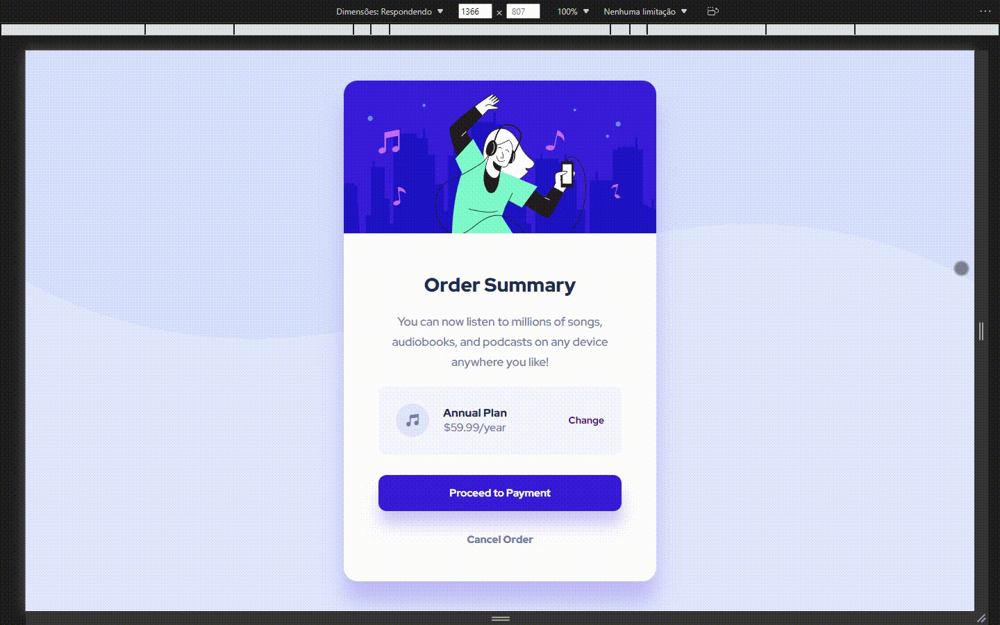

<h1 align="center">Order Summary Component</h1>

## Sobre o Projeto

Desenvolvido com base no [design](https://www.frontendmentor.io/challenges/order-summary-component-QlPmajDUj) proposto pelo site [Frontend Mentor](https://www.frontendmentor.io/home).

## Demonstração

  </img>

## Como acessar

A aplicação está hospedada no **GitHub Pages** e pode ser acessada [aqui](https://riandeoliveira.github.io/order-summary-component/).

## Tecnologias utilizadas

  <h3>Front-End</h3>
  </img>
  </img>
  </img>
  </img>

## Atualizado em

27 de mar. de 2022

## Desenvolvido em

20 de jan. de 2022

Made with 💙 by Rian Oliveira

